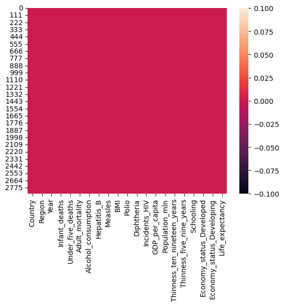
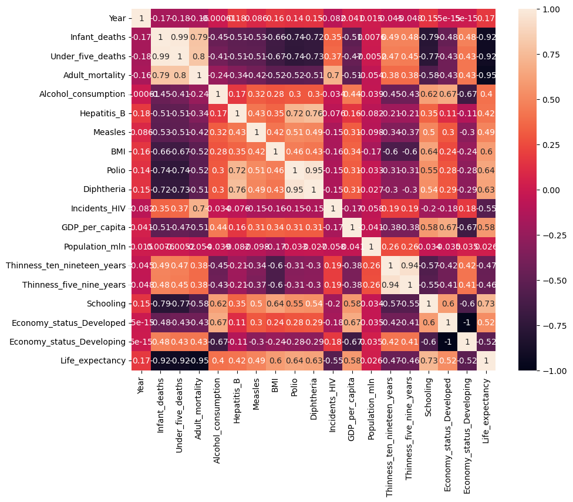
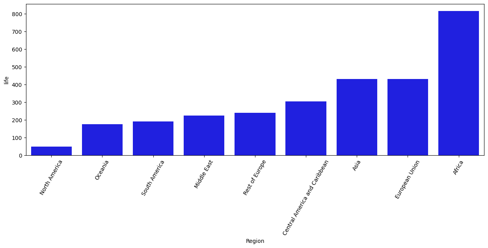
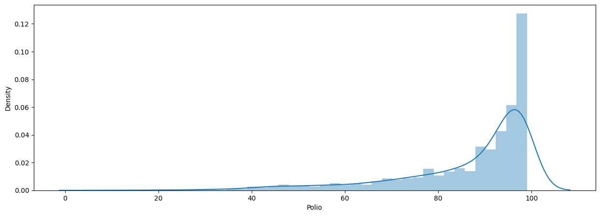
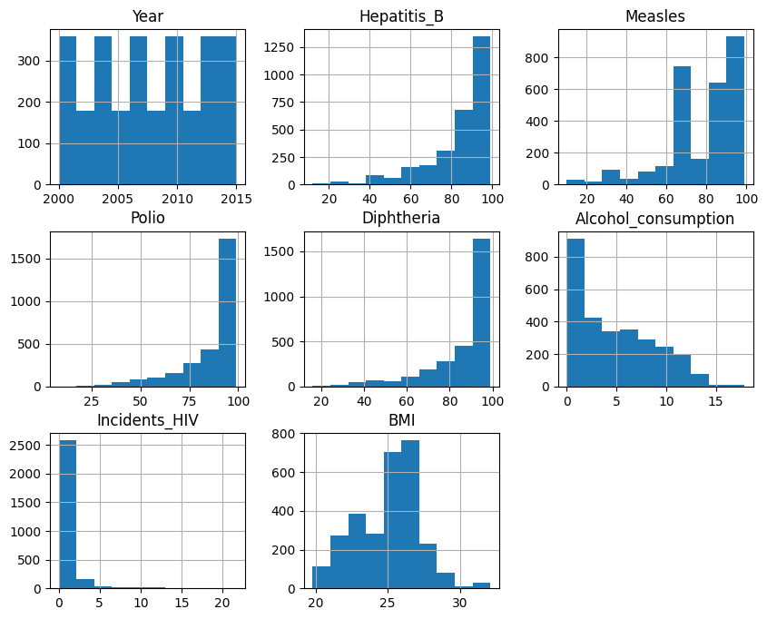

# Laporan Proyek Machine Learning
### Nama : Satria Ishanda Subakti
### Nim : 211351135
### Kelas : Pagi B

## Domain Proyek
Ekspektasi hidup ini berguna untuk mengetahui berapakah angka harapan hidup disuatu negara beradasarkan data orang-orang sudah melakukan imunisasi.
## Business Understanding
Dengan Ekspektasi hidup ini dapat memberitahukan kita bahwa pentingnya imunisasi dan sebagai pengingat kepada orang tua agar anak-anak mereka harus diberikan imunisasi sejak dini
bagian laporan ini mencakup
### Problem Statements
Ketidaktahuan kita mengenai angka harapan hidup disuatu negara
### Goals
Agar kita mengetahui angka harapan hidup disuatu negara berdasarkan imunisasi dan menjadi pengingat untuk setiap orang tua agar anaknya mendapatkan imunisasi
### Solution Statement
- website ini berisi tentang jumlah angka harapan hidup disuatu negara dengan pengguna harus mengisikan data seperti tahun, beberapa vaksin yang sudah diterima oleh orang-orang tersebut dan variabel lainnya dalam bentuk angka. datset ini terintegrasi dengan kaggle agar dapat dikatakan bahwa data tersebut valid
- Untuk Modeling data angka harapan hidup ini menggunakan metode regresi linier
## Data Understanding
Dataset yang saya gunakan diambil dari Kaggle dengan tema angka harapan Hidup. dataset ini berisi tentang tahun berapakah data tersebut tercatat, beberapa kolom menjelaskan tentang prediksi angka harapan hidup ketika orang-orang menerima vaksin seperti polio, difteria, campak dan sebagainya. untuk dataset sumbernya bisa cek link ini
[Life expentancy](https://www.kaggle.com/datasets/lashagoch/life-expectancy-who-updated)
## Variabel-variabel yang digunakan
- Year : digunakan untuk input tahun berapa data tersebut tercatat (Bertipe data Int)
- Hepatitis_B : Merupakan persentase cakupan imunisasi Hepatitis B (HepB3) pada anak usia 1 tahun (Bertipe data Int)
- Measles : Merupakan persentase cakupan imunisasi Campak yang mengandung vaksin dosis pertama (MCV1) pada anak usia 1 tahun (Betipe data Int)
- Polio : Merupakan persentase cakupan imunisasi Polio (Pol3) pada anak usia 1 tahun (Bertipe data Int)
- Diftheria : Merupakan persentase cakupan imunisasi Difteri pada anak usia 1 tahun (Bertipe data Int)
- Alcohol_consumption : Merupakan konsumsi alkohol yang dicatat dalam liter alkohol dengan usia 15+ tahun (Bertipe data Float)
- Incident_HIV : Insiden HIV per 1000 penduduk berusia 15-49 tahun (Bertipe data Float)
- BMI : adalah ukuran status gizi pada orang dewasa (Bertipe data Float)
- Life_expentancy : Harapan hidup rata-rata kedua jenis kelamin pada tahun-tahun yang berbeda dari 2010 hingga 2015 (Bertipe data Float)
## Data Preparation

### Data Discovery and Profiling
Untuk bagian ini saya menggunakan teknik EDA. Hal pertama yang dilakukan yaitu membuka text editor, disini saya memakai Google Colab lalu membuat file baru dengan format .ipynb lalu mengimport library yang dibutuhkan untuk pembahasan ini
``` python 
import numpy as np
import pandas as pd
import seaborn as sns
import matplotlib.pyplot as plt
```
karena kita menggunakan text editor google colab maka untuk pengerjaaannya dimulai dari import file dan melakukan file upload dengan mengambil token API kita dari kaggle yang nanti akan terdownload dengan kaggle.json
``` python
from google.colab import files
files.upload()
```
lalu ketika di running akan ada tombol untuk choose file, nah yang kita upload adalah file kaggle.json, tahap berikutnya adalah membuat direktori dan memberikan permission dengan cara 
``` python
!mkdir -p ~/.kaggle
!cp kaggle.json ~/.kaggle/
!chmod 600 ~/.kaggle/kaggle.json
!ls ~/.kaggle
```
selanjutnya kita panggil url dataset dari website kaggle untuk langsung didownload
``` python
!kaggle datasets download -d lashagoch/life-expectancy-who-updated
```
selanjutnya kita ekstrak dataset yang sudah kita download dengan cara
``` python
!mkdir life-expectancy-who-updated
!unzip life-expectancy-who-updated.zip -d life-expectancy-who-updated
!ls life-expectancy-who-updated
```
untuk pemanggilan dataset yang sudah kita ekstrak sebelumnya dan dataset ini akan dipakai untuk pengerjaan kali ini kita dapat memanggilnya dengan cara 
``` python
df = pd.read_csv('life-expectancy-who-updated/Life-Expectancy-Data-Updated.csv')
```
untuk melihat isi dari dataset dari 5 buah record awal, kita bisa memanggilnya dengan cara
``` python
df.head()
```
untuk melihat tipe data dari semua kolom di dataset tersebut kita bisa memanggilnya dengan cara
``` python
df.info()
```
untuk melihat semua nilai rata-rata maupun nilai dari kuartil 1 sampai kuartil 3 kita bisa memanggilnya dengan cara
``` python
df.describe()
```
untuk melihat berapa kali suatu value dengan tipe data object terpanggil di dataset, kita bisa menggunakan value_counts(). cara pemanggilannya yaitu
``` python
df["Region"].value_counts()
```
kita juga bisa mengurutkan isi dataset berdasarkan kolom tertentu, misal mengurutkan berdasarkan Region dengan cara
``` python
df.sort_values(by="Region", ascending=True).head()
```
untuk melihat apakah terdapat nilai yang kosong pada dataset, kita dapat memanggilnya dengan cara
```python
sns.heatmap(df.isnull())
```
Maka Hasilnya


untuk melihat sebaran data pada dataset ini kita dapat memanggilnya dengan cara

``` python
plt.figure(figsize=(10,8))
sns.heatmap(df.corr(),annot=True)
```
maka hasilnya


kita akan menampilkan data angka harapan hidup berdasarkan region/benua, untuk visualisasinya menggunakan barplot, sebelum itu kita deklarasikan
``` python
life = df.groupby('Region').count()[['Life_expectancy']].sort_values(by='Life_expectancy', ascending=True).reset_index()
life = life.rename(columns={'Life_expectancy':'life'})
```
setelah itu pemanggilannya yaitu
``` python
fig = plt.figure(figsize=(15,5))
sns.barplot(x=life['Region'], y=life['life'], color='blue')
plt.xticks(rotation=60)
```
maka hasilnya

lalu kita akan coba tampilkan distribusi dari fitur Polio dengan menggunakan distplot.
``` python
plt.figure(figsize=(15,5))
sns.distplot(df['Polio'])
```
maka hasilnya


## Modelling
sebelum melakukan modelling, kita perlu memanggil library yang diperlukan yaitu
``` python
from sklearn.model_selection import train_test_split
from sklearn.linear_model import LinearRegression
```
lalu kita mendefinisikan variabel bebas dan variabel terikatnya, disini saya menggunakan 8 variabel bebas dan 1 variabel terikat. pemanggilannya dengan cara
``` python
report = ['Year', 'Hepatitis_B', 'Measles', 'Polio', 'Diphtheria', 'Alcohol_consumption', 'Incidents_HIV', 'BMI']
x = df[report]
y = df['Life_expectancy']
x.shape, y.shape
```
8 variabel bebas diatas dimasukkan ke variabel report yang akan digunakan sebagai inputan sedangkan variabel life_expetancy akan menjadi variabel yang akan menjadi variabel terikat. 

sebelum melakukan regresi linier kita akan melihat distribusi variabel numerik dengan plot histogramnya dengam menggunakan hist, pemanggilannya dengan cara
``` python
df[report].hist(figsize=(10,8))
```
maka hasilnya

tahap selanjutnya yaitu memisahkan data training dan data testing dengan cara
``` python
x_train, x_test, y_train, y_test = train_test_split(x,y,random_state=70)
y_test.shape
```
selanjutnya data training dan data testing akan dimasukkan ke dalam model regresi dengan cara
``` python
lr = LinearRegression()
lr.fit(x_train, y_train)
pred = lr.predict(x_test)
```
untuk mengetahui nilai akurasi model regresi linier dapat dipanggil dengan cara
``` python
value = lr.score(x_test, y_test)
print('Akurasi Model regresi linier = ', value)
```
dan hasilnya yaitu


didapatkan hasil akurasi regresinya sebesar 73.9% maka dipastikan data pada dataset ini terbilang bagus. lalu tahap selanjutnya kita coba menginput masing-masing variabel yang kita panggil sebelumnya dengan salah satu record dari dataset tersebut dengan cara
``` python
input_data = np.array([[2015, 97, 94, 97, 97, 10.35, 0.09, 26]])

prediction = lr.predict(input_data)
print('estimasi angka harapan hidup :', prediction)
```
maka hasilnya yaitu : [76.84378335]
ketika sudah berhasil, jangan lupa untuk menyimpan model menggunakan pickle
``` python
import pickle

filename = 'life_expectancy.sav'
pickle.dump(lr,open(filename,'wb'))
```
## Evaluation 
Untuk Evaluasi saya menggunakan R-Square atau disebut juga koefisien determinasi, adalah ukuran statistik yang menunjukkan seberapa cocok suatu data dengan model regresi, kita panggil dengan cara 
``` python
from sklearn.metrics import r2_score
score_of_r2 = r2_score(y_test, pred)
print(f"Precision = {score_of_r2}")
```
dan didapat hasilnya adalah 0.7392315286502513 atau bisa dikatakan 73%, jika dilihat hasilnya sama dengan yang menggunakan regresi linier
## Deployment
[Hasil Streamlitnya](https://app-life-expectancy-satriais.streamlit.app/)

